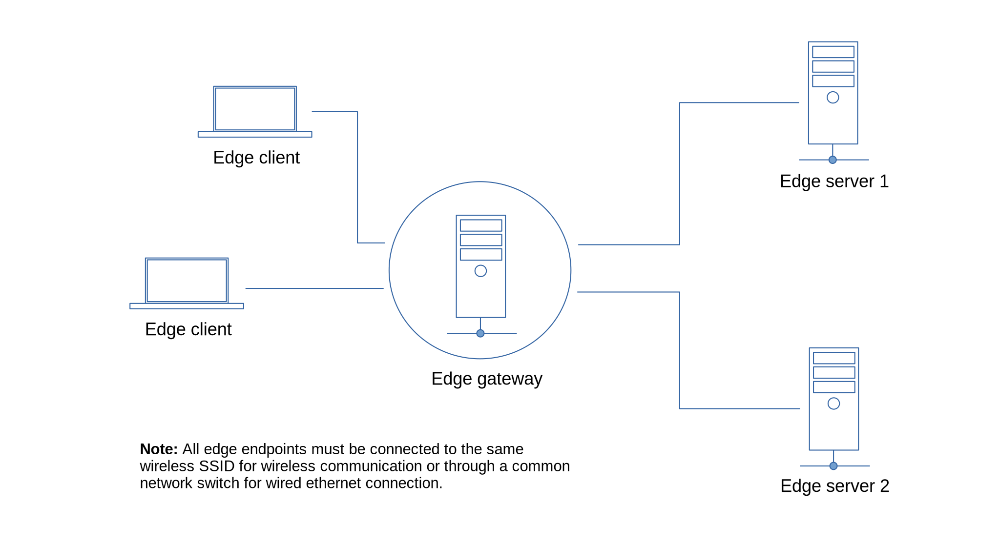

## Edge Gateway



Instead of each client accessing directly the edge servers, we will create an edge gateway that will act as broker between the edge clients and the edge servers.  

<br>

### Edge Server 1

#### 1. Create a device project directory and install *m2m*.

```js
$ npm install m2m
```

#### 2. Save the code below as *server.js* in your server 1 project directory.

```js
const m2m = require('m2m')

// simulated voltage data source
function dataSource(){
  return 20 + Math.floor(Math.random() * 10)
}

// for a secure edge access, create a user object
// to authenticate your edge connection with node-m2m server
let user = new m2m.User()

/***
 * tcp edge server 1
 */
let edge = new m2m.Edge()

let port = 8134

user.connect(() => {
  edge.createServer(port, (server) => {
      console.log('tcp server 1 :', port)

      server.dataSource('voltage-source', (tcp) => {
          tcp.send(dataSource())         
      })

      server.on('error', (err) => { 
          console.log('error:', err.message)
      })
  })
})
```
#### 3. Start your device application.

```js
$ node device.js
```

### Edge Server 2
```js
const m2m = require('m2m')

// simulated temperature data source
function dataSource(){
  return 50 + Math.floor(Math.random() * 10)
}

// for a secure edge access, create a user object
// to authenticate your edge connection with node-m2m server
let user = new m2m.User()

/***
 * tcp edge server 2
 */
let edge = new m2m.Edge()

let port = 8135 

user.connect(() => {
  edge.createServer(port, (server) => {
      console.log('tcp server 2 :', port)

      server.dataSource('temp-source', (tcp) => {
          tcp.send(dataSource())         
      })

      server.on('error', (err) => { 
          console.log('error:', err.message)
      })
  })
})
```

### Edge Gateway
```js
const m2m = require('m2m')

let user = new m2m.User()

/***
 * tcp edge clients
 */
let edge = new m2m.Edge()

/***
 * tcp edge gateway or edge broker
 */
let port = 8129

user.connect(app)

function app(){
  let ec1 = new edge.client(8134)
  let ec2 = new edge.client(8135)

  edge.createServer(port, (server) => {
      console.log('tcp gateway :', port)

      server.publish('voltage', (tcp) => {
          ec1.read('voltage-source', (data) => {
              tcp.send({type:'voltage', value:data.toString()})    
          })
      })

      server.publish('temperature', (tcp) => {
          ec2.read('temp-source', (data) => {
              tcp.send({type:'temperature', value:data.toString()})   
          })
      })

      // monitor connected client
      // ensure the connected clients does not continously increase 
      server.on('connection', (count) => { 
          console.log('gateway connected client', count)
      })
  })
}
```

### Edge Client
```js
const m2m = require('m2m')

let user = new m2m.User()

/***
 * tcp edge client 1
 */
let edge = new m2m.Edge()

user.connect(app)

function app(){
  let ec1 = new edge.client(8129)

  ec1.sub('voltage', (data) => {
      console.log('voltage', data)
  })

  ec1.sub('temperature', (data) => {
      console.log('temperature', data)
  })

  ec1.on('error', (err) => { 
      console.log('error:', err.message)
  })
}
```

#### 3. Start the client application.

```js
$ node client.js
```
You should get a similar result as shown below.
```js
voltage { type: 'voltage', value: '21' }
temperature { type: 'temperature', value: '56' }
voltage { type: 'voltage', value: '22' }
temperature { type: 'temperature', value: '52' }
voltage { type: 'voltage', value: '23' }
temperature { type: 'temperature', value: '54' }

```


